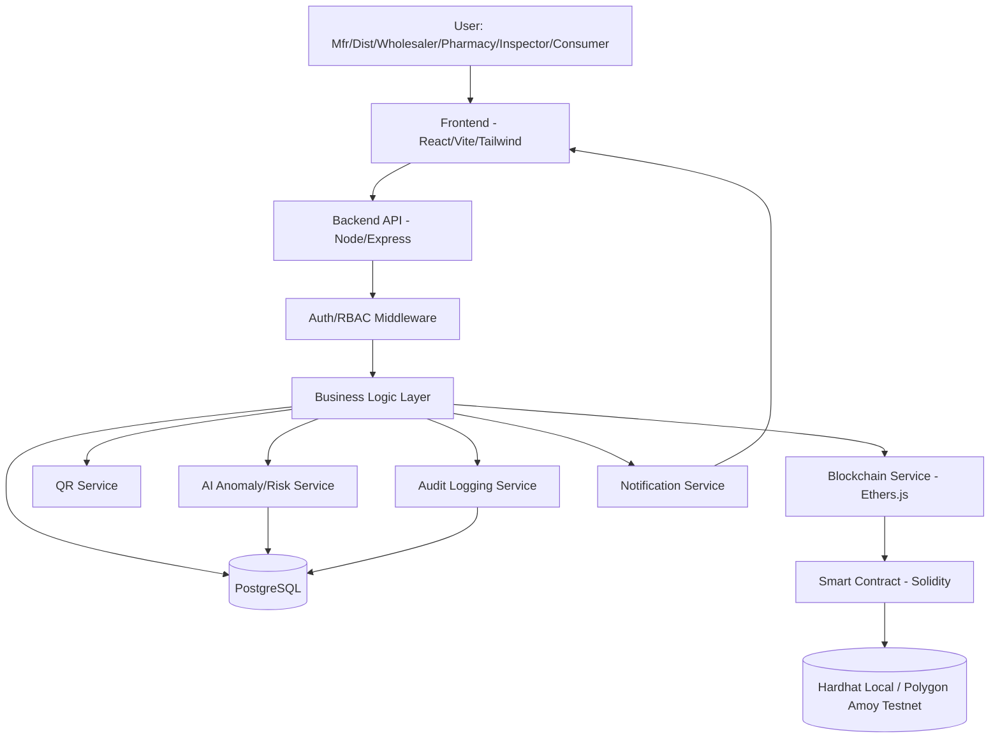

# PharmaTrace — Product Requirements Document (PRD)
**Version:** 1.0 (MVP) | **Prepared for:** Smart India Hackathon (SIH) | **Target build method:** AI-assisted development (Google Antigravity / vibe coding)

---

## 1. Executive Summary

PharmaTrace is a blockchain-anchored pharmaceutical supply-chain traceability and counterfeit-detection platform. It gives every medicine batch a unique digital identity and QR code, records custody transfers (Manufacturer → Distributor → Wholesaler → Pharmacy → Consumer) as tamper-evident blockchain events, and lets anyone verify a medicine's authenticity, current status, and chain of custody by scanning its QR code. A lightweight AI layer flags anomalous supply-chain behavior and produces an advisory risk score; deterministic security rules — not AI — remain the final authority on verification outcomes. This is a hackathon MVP: it proves the architecture and workflow convincingly, but it is **not** a certified pharmaceutical-regulatory system and does not physically authenticate a pill.

## 2. Problem Statement

Pharmaceutical supply chains today suffer from: counterfeit and substituted medicines entering circulation; fragmented, paper-based or siloed records across manufacturers, distributors, and pharmacies; no reliable way for a pharmacist or patient to verify a medicine's origin; duplicated or cloned product identifiers; slow, manual recall propagation; and no trustworthy, tamper-evident audit trail of who held a medicine and when. *(Any market-size or fraud-rate figures are "To be validated" — no statistics are asserted here.)* PharmaTrace addresses the **information-trust** problem: it cannot inspect physical tablets, but it can make the record of a medicine's journey cryptographically verifiable and hard to falsify without detection.

## 3. Vision

A supply chain where every legitimate medicine batch carries a verifiable digital identity, every custody change is recorded immutably, and any stakeholder — from a wholesaler to a patient — can check authenticity and status in seconds via a QR scan.

## 4. Objectives

- Give each batch/package a unique on-chain identity and QR code.
- Record every custody transfer as an auditable blockchain event.
- Let pharmacies and consumers verify authenticity, status, expiry, and recall state instantly.
- Detect suspicious patterns (duplicate scans, unauthorized custody, impossible geography/timing) using deterministic rules first, AI risk-scoring second.
- Provide admin/inspector dashboards for supply-chain-wide monitoring and audit.
- Demonstrate a technically convincing, judge-explainable MVP within hackathon constraints.

## 5. Target Users

Manufacturers, distributors, wholesalers, pharmacies/pharmacists, regulatory inspectors/auditors, patients/consumers, and a platform system administrator.

## 6. User Roles & Permissions

### 6.1 System Administrator
- **Purpose:** Platform oversight, user/entity approval, monitoring, recall authorization.
- **Auth:** Email + password (hashed), JWT session, admin-only route guard.
- **Permissions:** Approve/reject manufacturer & distributor registrations; view all data; view AI risk dashboard; view audit logs; trigger/approve recalls; pause contract (emergency).
- **Creates:** User approvals, recall records, security-event acknowledgments.
- **Reads:** Everything.
- **Blockchain tx:** `pauseContract()`, `approveRecall()` (if separate from manufacturer-initiated recall), role-grant transactions.
- **Cannot modify:** Historical blockchain events (immutable by design); cannot fabricate custody records.
- **Security:** MFA recommended (future scope; MVP may use strong password + optional TOTP if time allows), full audit logging of every admin action.
- **Dashboard:** Platform KPIs, suspicious activity feed, AI risk dashboard, audit log viewer, recall management.

### 6.2 Manufacturer
- **Purpose:** Register batches, generate QR codes, initiate first transfer.
- **Auth:** Registered + admin-approved account, JWT; blockchain actions require the manufacturer's linked wallet address (backend-custodied for MVP, see §11.7).
- **Permissions:** Create medicine/batch records, generate QR codes, transfer custody to a distributor, flag/recall own batches.
- **Creates:** Medicine, batch, package, QR, transfer-out events.
- **Reads:** Own batches, their full history, verification stats.
- **Blockchain tx:** `registerMedicineBatch()`, `transferCustody()`, `flagMedicine()`, `recallBatch()`.
- **Cannot modify:** Batches after distributor receipt is confirmed on-chain; other manufacturers' data.
- **Dashboard:** Batches created, active/distributed batches, flagged batches, verification activity.

### 6.3 Distributor / 6.4 Wholesaler
- **Purpose:** Receive custody from the upstream party, hold, and transfer downstream.
- **Auth:** Registered + admin-approved, JWT + wallet.
- **Permissions:** `confirmReceipt()`, `transferCustody()` to the next authorized party only; cannot alter batch/product data, only custody state.
- **Reads:** Own current inventory and its history.
- **Cannot modify:** Product-level fields set by manufacturer.
- **Dashboard:** Incoming shipments, transfer form, receipt history.

### 6.5 Pharmacy Owner/Pharmacist
- **Purpose:** Final commercial custodian; verifies and dispenses to consumers.
- **Auth:** Registered + admin-approved, JWT + wallet.
- **Permissions:** `confirmReceipt()`, `verifyMedicine()`, `flagMedicine()` (raise suspicion), mark as dispensed.
- **Reads:** Own inventory, verification/scan history, recall notices.
- **Cannot modify:** Upstream custody history.
- **Dashboard:** Inventory, scan/verify tool, flagged items, recall notifications.

### 6.6 Inspector/Auditor
- **Purpose:** Read-only regulatory oversight and investigation.
- **Auth:** Registered + admin-approved, JWT.
- **Permissions:** Read-only across all batches, custody chains, audit logs, suspicious-activity feed. **Cannot** write any state.
- **Dashboard:** Search medicine/batch, full chain-of-custody viewer, audit trail, suspicious-activity list.

### 6.7 Patient/Consumer
- **Purpose:** Verification-only end user.
- **Auth:** None required for public verification page (optional lightweight account for scan history, future scope).
- **Permissions:** Scan/enter a QR identifier, view verification result. Cannot see internal business data (prices, distributor identities beyond what's appropriate).
- **Security restriction:** Rate-limited scanning endpoint to prevent scraping/abuse.

**Access-control summary:** Administrative authority (Admin) ≠ Supply-chain authority (Manufacturer/Distributor/Wholesaler/Pharmacy, each scoped to their own custody actions) ≠ Verification-only authority (Inspector = read-only privileged; Consumer = read-only public). All enforced server-side via RBAC middleware and mirrored by `onlyRole` modifiers on-chain for state-changing calls.

## 7. Functional Requirements (Workflows)

Each workflow below follows: Actor → Preconditions → User Actions → Backend Processing → Blockchain Interaction → DB Interaction → AI/Security Checks → Expected Result → Failure Conditions → Security Considerations.

**A–B. Manufacturer Registration & Login** — Actor: Manufacturer. Preconditions: none (registration) / approved account (login). Actions: submit company + license info → admin approval queue; login with email/password. Backend: hash password (bcrypt), create `users`+`manufacturers` row with `status=PENDING`; on approval, admin sets `status=APPROVED` and a blockchain role-grant tx registers the manufacturer's wallet on-chain (`registerManufacturer()`). DB: `users`, `manufacturers`. AI/security: none at registration; login has rate-limiting + lockout after repeated failures. Result: approved manufacturer can create batches. Failure: duplicate license ID rejected; unapproved accounts blocked from write actions. Security: password hashing, JWT with short expiry + refresh token, license uniqueness constraint.

**C–F. Batch Registration, ID Generation, QR Generation** — Actor: Manufacturer. Preconditions: approved account. Actions: fill medicine/batch form. Backend: validate fields, generate UUID `batchId` and per-package IDs (if package-level, see §9), compute a metadata hash (SHA-256 of canonicalized batch data), write full record to DB, call `registerMedicineBatch(batchId, metadataHash, ...)` on-chain. Blockchain: emits `BatchRegistered` event, returns tx hash stored in DB. QR: generated payload = signed JSON `{batchId, packageId?, nonce, sig}` (see §16) rendered as a QR image, linked via a verification URL `https://.../verify/:id`. DB: `medicines`, `batches`, `packages`, `qr_codes`. AI/security: duplicate batch-number check before write. Result: batch live on-chain with printable QR. Failure: duplicate batch number rejected (409); blockchain tx failure rolls back the DB write is avoided by writing DB first with `status=PENDING_CHAIN` then confirming after tx receipt (see §11.6 for failure handling pattern). Security: only approved manufacturer wallet can call the contract function; input validation server + contract side.

**G–J. Custody Transfers (Mfr→Dist→Wholesaler→Pharmacy) & Receipt Confirmation** — Actor: current custodian. Preconditions: caller is the current on-chain custodian; recipient is an approved, correctly-roled account. Actions: initiate transfer to recipient address/ID. Backend: validates recipient role is the expected next stage (state machine, §17), calls `transferCustody(batchId/packageId, toAddress)`. Recipient later calls `confirmReceipt()`. DB: `shipments`, `custody_transfers` row per hop. Blockchain: emits `CustodyTransferred`/`ReceiptConfirmed`. AI/security: flags if transfer skips an expected stage or targets an unapproved address (Rule 3/§18). Result: on-chain custodian updated, history appended. Failure: unauthorized transfer reverts on-chain and is rejected server-side before the tx is even sent; unconfirmed shipments after a timeout are flagged. Security: `onlyCurrentCustodian` modifier; backend re-checks role on every call (never trust frontend).

**K–L. Pharmacy Verification & Consumer QR Scanning** — Actor: Pharmacy/Consumer. Preconditions: QR exists. Actions: scan or enter identifier. Backend: `POST /api/verify/scan` looks up the QR record, verifies signature, checks batch status against deterministic rules (§18), queries the smart contract for the current on-chain custodian/state, computes/consults the AI risk score, logs a `verification_records` row (this is also the duplicate-scan signal). Result: one of the verification states in §16.5 is returned. Failure: invalid/unknown QR → `INVALID QR`/`UNKNOWN PRODUCT`. Security: rate-limited endpoint; signature check prevents QR fabrication.

**M–N. Authentic vs. Counterfeit/Suspicious Detection** — Deterministic rules (§18) run first (hash mismatch, custodian mismatch, recall, expiry, duplicate-location scan). AI anomaly service (§18/19) runs afterward and can only *add* a risk score/flag, never downgrade a deterministic `INVALID`/`RECALLED` result to "authentic."

**O. Medicine Recall** — Actor: Manufacturer or Admin. Actions: initiate recall with reason. Backend: `recallBatch(batchId, reason)` on-chain sets status `RECALLED`, DB `recalls` row created, notification fan-out to all custodians who ever held the batch (from `custody_transfers`) and severity=`HIGH`/`CRITICAL` alert to Admin. Any subsequent verification of that batch returns `RECALLED` regardless of other state.

**P. Expired Medicine Detection** — Deterministic: verification endpoint compares `expiryDate` to current date every scan; no blockchain write needed (read-only check).

**Q. Duplicate QR Detection** — Every successful scan is logged with timestamp (+ optional geolocation if provided by client). Rule 4 (§18): if the same package-level QR is scanned from two mutually-impossible location/time combinations, or scanned as "received" by two different custodians, mark `SUSPICIOUS DUPLICATE` and raise a security event.

**R. Unauthorized Transfer Detection** — On-chain `onlyCurrentCustodian` prevents it at the contract level; backend additionally flags any *attempted* unauthorized call (caught revert) as a security event for the dashboard.

**S. Supply-Chain Audit / T. Admin Monitoring** — Inspector/Admin dashboards query `audit_logs`, `custody_transfers`, and on-chain events (via indexed event logs) to reconstruct full timelines; nothing here is a new write path.

## 8. User Journeys (illustrative, condensed)

**Manufacturer:** Register → wait for approval → login → create batch → get QR → print/affix QR → transfer to distributor.
**Distributor/Wholesaler:** Login → see incoming shipment → confirm receipt → later transfer onward.
**Pharmacy:** Login → confirm receipt → verify/scan → sell/dispense → optionally flag.
**Consumer:** Scan QR (no login) → see plain-language verification result.
**Inspector:** Login → search batch/medicine → view full custody timeline and any flags.
**Admin:** Login → approve accounts → monitor AI risk dashboard/security events → manage recalls.

## 9. Medicine Lifecycle & Data Granularity

**Product-level data** (rarely changes): medicine name, generic name, brand, dosage form, strength, storage requirements — stored once per product, referenced by batches.
**Batch-level data**: batch number, manufacturing date, expiry date, quantity, manufacturer, status, blockchain batch ID.
**Shipment-level data**: origin, destination, carrier/reference, timestamps, linked custody-transfer transactions.
**Individual-package-level data**: a per-unit or per-carton QR identifier, linked to its parent batch.

**Recommendation for MVP: hybrid, batch-level as default with optional package-level QR generation.** Rationale: full package-level (every strip/box individually on-chain) maximizes duplicate-detection fidelity but multiplies gas cost and demo complexity; pure batch-level QR (one QR per batch) is cheap and simple but can't catch a single cloned physical package within a batch. The hybrid model registers the **batch** on-chain once, then generates **package-level QR codes** (an off-chain-signed identifier referencing the batch, not a separate on-chain record) so duplicate-scan detection still works at the unit level without a blockchain write per package. This is explainable to judges, keeps gas costs bounded, and still demonstrates unit-level counterfeit detection via the off-chain signature + scan-log logic.

## 10. System Architecture



## 11. Blockchain Architecture

**11.1 Recommended network — Local Hardhat network for development/demo, with a Polygon Amoy testnet deployment as the "real chain" proof for judges.** Rationale: Hardhat gives instant, free, deterministic transactions for reliable live demos (no faucet/RPC flakiness risk); Polygon Amoy (EVM-compatible, low/free test gas) provides a public, judge-verifiable block explorer link as evidence the same contract works on a real public testnet. Avoid Ganache (less actively maintained) and avoid mainnet (cost, irreversibility, inappropriate for a prototype with test data).

**11.2 Smart contract responsibilities:** identity registration (manufacturers/roles), batch registration + metadata hash anchoring, custody transfer state transitions, flag/recall status, and an immutable event log. The contract is the **source of truth for custody and status**, not for rich descriptive data.

**11.3 On-chain / off-chain / hash split**

| Data | Location | Why |
|---|---|---|
| Batch ID, current custodian, status enum, recall flag, timestamps | **On-chain** | Must be tamper-evident and independently verifiable |
| Custody-transfer events | **On-chain (events)** | Immutable audit trail is the core value proposition |
| Metadata hash (SHA-256 of full batch record) | **On-chain** | Lets anyone detect if off-chain data was altered, without storing bulky data on-chain |
| Medicine name, dosage, storage instructions, manufacturer profile, addresses | **Off-chain (PostgreSQL)** | High-volume, mutable-adjacent, not needed for trust — just needs to match its hash |
| QR scan logs, AI risk scores, security events | **Off-chain (PostgreSQL)** | High-frequency writes; gas-prohibitive on-chain; not part of the trust root |
| Personal data (names, contact info) | **Off-chain, never on-chain** | Public blockchains are permanent and public — PII must never be written there |

**11.4 Smart contract functions (redesigned/consolidated for MVP):**
`registerEntity(address, role)` (admin-only role grant) · `registerBatch(bytes32 batchId, bytes32 metadataHash, address manufacturer)` · `transferCustody(bytes32 batchId, address to)` · `confirmReceipt(bytes32 batchId)` · `flagBatch(bytes32 batchId, string reason)` · `recallBatch(bytes32 batchId, string reason)` · `getBatch(bytes32 batchId) view` · `getCustodyHistory(bytes32 batchId) view` (via indexed events, not storage array, to save gas).

**11.5 Access control & role management:** OpenZeppelin `AccessControl` with roles `ADMIN_ROLE`, `MANUFACTURER_ROLE`, `DISTRIBUTOR_ROLE`, `WHOLESALER_ROLE`, `PHARMACY_ROLE`. State-changing functions carry `onlyRole(...)` and, for custody actions, an additional `onlyCurrentCustodian(batchId)` check.

**11.6 Transaction lifecycle & failure handling:** Backend writes an off-chain record with `chain_status=PENDING` → sends tx → on receipt, updates `chain_status=CONFIRMED` + stores tx hash → if tx reverts/fails, `chain_status=FAILED` and the user sees a clear error with retry option. The DB row is never treated as "true" until chain-confirmed, avoiding a false sense of on-chain proof.

**11.7 Wallet handling for MVP:** Each business-role account is mapped 1:1 to a **backend-custodied wallet** (server holds the key, encrypted at rest, in a KMS/env-secret — never sent to frontend) so ordinary users don't need MetaMask literacy during a live demo. This is explicitly flagged as an MVP simplification; production would use per-user client-side wallets or a custody provider — documented in §37 assumptions.

**11.8 Judge verifiability:** every write returns a transaction hash rendered in the UI as a clickable block-explorer link (Amoy explorer for the testnet deployment); the "Blockchain Transactions" admin page lists raw on-chain events so judges can independently confirm state matches the UI.

**11.9 Gas & other considerations:** batch/package granularity chosen (§9) specifically to bound gas usage; no on-chain loops over unbounded arrays (history reconstructed from indexed events); front-running is a negligible concern here (no financial/ordering-sensitive value transfer) but custody-transfer calls still validate `msg.sender == currentCustodian` to prevent race-condition hijacks.

## 12. Smart Contract Specification

```solidity
// SPDX-License-Identifier: MIT
pragma solidity ^0.8.24;

import "@openzeppelin/contracts/access/AccessControl.sol";
import "@openzeppelin/contracts/security/Pausable.sol";

contract PharmaTrace is AccessControl, Pausable {
    bytes32 public constant MANUFACTURER_ROLE = keccak256("MANUFACTURER_ROLE");
    bytes32 public constant DISTRIBUTOR_ROLE  = keccak256("DISTRIBUTOR_ROLE");
    bytes32 public constant WHOLESALER_ROLE   = keccak256("WHOLESALER_ROLE");
    bytes32 public constant PHARMACY_ROLE     = keccak256("PHARMACY_ROLE");

    enum Status { CREATED, IN_TRANSIT, RECEIVED, FLAGGED, RECALLED, DISPENSED }

    struct MedicineBatch {
        bytes32 batchId;
        bytes32 metadataHash;
        address manufacturer;
        address currentCustodian;
        Status status;
        uint256 createdAt;
        bool exists;
    }

    mapping(bytes32 => MedicineBatch) public batches;

    event BatchRegistered(bytes32 indexed batchId, address indexed manufacturer, bytes32 metadataHash, uint256 timestamp);
    event CustodyTransferred(bytes32 indexed batchId, address indexed from, address indexed to, uint256 timestamp);
    event ReceiptConfirmed(bytes32 indexed batchId, address indexed by, uint256 timestamp);
    event BatchFlagged(bytes32 indexed batchId, string reason, uint256 timestamp);
    event BatchRecalled(bytes32 indexed batchId, string reason, uint256 timestamp);

    modifier onlyCurrentCustodian(bytes32 batchId) {
        require(batches[batchId].exists, "Batch does not exist");
        require(batches[batchId].currentCustodian == msg.sender, "Not current custodian");
        _;
    }

    constructor(address admin) {
        _grantRole(DEFAULT_ADMIN_ROLE, admin);
    }

    function registerBatch(bytes32 batchId, bytes32 metadataHash)
        external onlyRole(MANUFACTURER_ROLE) whenNotPaused
    {
        require(!batches[batchId].exists, "Batch already exists");
        require(metadataHash != bytes32(0), "Invalid hash");
        batches[batchId] = MedicineBatch(batchId, metadataHash, msg.sender, msg.sender, Status.CREATED, block.timestamp, true);
        emit BatchRegistered(batchId, msg.sender, metadataHash, block.timestamp);
    }

    function transferCustody(bytes32 batchId, address to)
        external onlyCurrentCustodian(batchId) whenNotPaused
    {
        require(to != address(0), "Zero address");
        require(batches[batchId].status != Status.RECALLED, "Batch recalled");
        address from = batches[batchId].currentCustodian;
        batches[batchId].currentCustodian = to;
        batches[batchId].status = Status.IN_TRANSIT;
        emit CustodyTransferred(batchId, from, to, block.timestamp);
    }

    function confirmReceipt(bytes32 batchId) external whenNotPaused {
        require(batches[batchId].currentCustodian == msg.sender, "Not recipient");
        batches[batchId].status = Status.RECEIVED;
        emit ReceiptConfirmed(batchId, msg.sender, block.timestamp);
    }

    function flagBatch(bytes32 batchId, string calldata reason) external whenNotPaused {
        require(batches[batchId].exists, "Batch does not exist");
        batches[batchId].status = Status.FLAGGED;
        emit BatchFlagged(batchId, reason, block.timestamp);
    }

    function recallBatch(bytes32 batchId, string calldata reason)
        external onlyRole(DEFAULT_ADMIN_ROLE) whenNotPaused
    {
        require(batches[batchId].exists, "Batch does not exist");
        batches[batchId].status = Status.RECALLED;
        emit BatchRecalled(batchId, reason, block.timestamp);
    }

    function getBatch(bytes32 batchId) external view returns (MedicineBatch memory) {
        return batches[batchId];
    }

    function pause() external onlyRole(DEFAULT_ADMIN_ROLE) { _pause(); }
    function unpause() external onlyRole(DEFAULT_ADMIN_ROLE) { _unpause(); }
}
```

**Security requirements implemented/explained:** `AccessControl` role gating (prevents unauthorized calls); `onlyCurrentCustodian` (prevents custody hijack); zero-address check on transfer; `Pausable` emergency stop (admin can freeze all state changes if a bug/attack is discovered mid-demo); explicit **non-upgradeable** MVP decision (documented in §37 — upgradeability adds proxy-pattern complexity/risk not justified for a prototype); Solidity ^0.8 has built-in overflow/underflow protection so no SafeMath needed; no reentrancy-sensitive value transfer exists (no ETH/token transfers), so a reentrancy guard is not required but is noted as a pattern to add if payments are introduced later; duplicate registration prevented by `exists` check; every state change emits an event (audit trail).

## 13. Database Architecture (see §21 for full schema)

PostgreSQL is recommended over MongoDB: the data is inherently relational (users → roles → batches → custody chains → verification logs with strict foreign-key integrity requirements), and Postgres gives strong constraint enforcement (unique batch numbers, FK integrity) that matters for a trust-sensitive system.

## 14. Backend Architecture

**Stack:** Node.js + Express (TypeScript recommended). **Structure:** `controllers/` (HTTP handlers) → `services/` (business logic: `authService`, `blockchainService`, `qrService`, `aiService`, `notificationService`, `auditService`) → `models/` (DB access, e.g. Prisma or Knex) → `middleware/` (`authenticate`, `authorize(role)`, `rateLimit`, `validateBody`). Blockchain interaction is isolated in `blockchainService` (wraps Ethers.js contract calls, tx confirmation polling, error normalization) so controllers never touch Ethers.js directly. AI service can run as an in-process Node module for the MVP (simplicity) with a clean interface so it could be extracted into a Python microservice later without changing callers.

## 15. Frontend Architecture

**Stack:** React + Vite + Tailwind CSS, React Router for role-based routes, a shared API client (Axios) with interceptors for JWT attach/refresh. State: React Query for server state, lightweight context for auth/session. Route guards check role client-side for UX only — **all real enforcement is server-side.**

## 16. QR Verification Architecture

1. **Generation:** on batch/package creation, backend creates payload `{id, type: "batch"|"package", nonce, issuedAt}`, computes an HMAC/ECDSA signature over it using a server-held signing key, and encodes `{payload, signature}` (base64) into the QR — **not** raw medicine data.
2. **Contents:** the QR encodes only an opaque identifier + signature + a verification URL (`https://app/verify?d=<encoded>`); no medicine name/price/PII is embedded.
3. **Blockchain link:** the `id` maps 1:1 to the on-chain `batchId`; scanning triggers a lookup against both DB and contract state.
4. **Scanning:** consumer/pharmacy uses an in-browser camera QR scanner (e.g. `html5-qrcode`) or manual code entry.
5. **Backend verification:** `POST /api/verify/scan` decodes payload, re-computes and checks the signature (catches tampering/fabrication), looks up DB record.
6. **Blockchain verification:** cross-checks `getBatch(batchId)` on-chain status/custodian against the DB's expectation; mismatch → `SUSPICIOUS`.
7. **Duplicate detection:** every scan is logged with timestamp (+optional geolocation); Rule 4 (§18) flags implausible repeats.
8/9/10. **Display:** pharmacy view shows full internal detail (custodian chain, batch data); consumer view shows a simplified plain-language result (status + basic batch info, no internal business data).
11–13. **Invalid/Recalled/Expired handling:** each returns its own explicit state (§16.5) rather than a generic error, so the UI can show the right message and severity color.

**16.5 Verification states:** `VERIFIED_AUTHENTIC`, `VERIFIED_BUT_FLAGGED`, `EXPIRED`, `RECALLED`, `INVALID_QR`, `UNKNOWN_PRODUCT`, `SUSPICIOUS_DUPLICATE`, `UNAUTHORIZED_TRANSFER`, `VERIFICATION_FAILED` (system/technical error, distinct from a security finding).

## 17. Cybersecurity Architecture

**Authentication:** bcrypt/argon2 password hashing; JWT access tokens (short-lived, ~15 min) + rotating refresh tokens (httpOnly cookie); account lockout after repeated failed logins; MFA (TOTP) listed as MVP-stretch/future.
**Authorization:** RBAC enforced in Express middleware on every protected route; wallet-address-to-role binding checked before any blockchain call is issued; frontend role checks are UX-only.
**API security:** Zod/Joi schema validation on all inputs; `express-rate-limit` on auth and verification endpoints; strict CORS allow-list; centralized error handler that never leaks stack traces to clients; `helmet` for secure headers.
**Blockchain security:** backend-held signing keys never exposed to frontend or logs; every outgoing tx is validated against expected role/state before submission; contract-level `onlyRole`/`onlyCurrentCustodian` is the final backstop even if backend validation were bypassed.
**Data security:** HTTPS/TLS in transit; sensitive columns (if any PII) encrypted at rest or minimized entirely; secrets via environment variables / a secrets manager, never committed to source; `.env.example` documents required vars without values.
**QR security:** see §16 — signed opaque payload, not raw data; duplication caught via scan-log pattern analysis, not QR content alone.
**Audit logging:** every state-changing action logs actor (user ID + role), action type, target entity, timestamp, resulting tx hash (if any), and severity, into `audit_logs` / `security_events`.

## 18. AI Architecture & Risk Scoring

**Design principle:** deterministic security rules run first and are authoritative; the AI layer only adds an advisory signal on top. Pipeline: `Supply Chain Event → Validation → Blockchain Tx → Event Indexing → Deterministic Security Rules → AI Anomaly Detection → Risk Score → Alert → Dashboard`.

**Deterministic rules (final authority):**
1. QR identifier not found → `INVALID`.
2. On-chain metadata hash mismatch vs. off-chain record → `SUSPICIOUS`.
3. Current on-chain custodian ≠ expected custodian for the scanning context → `UNAUTHORIZED_TRANSFER`.
4. Same package QR scanned from mutually-impossible location/time combinations → `SUSPICIOUS_DUPLICATE`.
5. `status == RECALLED` → `RECALLED` (overrides everything else).
6. `expiryDate < now` → `EXPIRED`.
7. Repeated failed verification attempts on one identifier → escalate severity to `HIGH`.
8. Signature/hash mismatch on the QR payload → `TAMPER_DETECTED` (folds into `INVALID`).

**AI anomaly detection (advisory only):** input = recent event stream per batch/entity (transfer frequency, time-between-hops, scan geography, failure counts); processing = a lightweight **Isolation Forest** (unsupervised outlier detection, well-suited to sparse hackathon-scale data with no labeled "fraud" examples) implemented in a small Python or Node (e.g. `ml-isolation-forest`) module running as part of/alongside the backend; output = a **0–100 risk score** plus contributing factors; runs on a schedule / on each new event, not synchronously in the verification hot path (verification returns deterministic results immediately; risk score enriches the dashboard). **This score is explicitly labeled in the UI as an advisory signal, never as proof of counterfeiting.** MVP fallback if ML library integration is time-constrained: a transparent weighted rule-based score (each factor in §"Risk Scoring" contributes fixed points) — equally valid for the demo and easier to explain to judges. Future scope: supervised models trained on confirmed-fraud-labeled data, geographic clustering, graph-based collusion detection.

## 19. AI Risk Scoring — Factor Detail

| Factor | Contribution |
|---|---|
| Duplicate/implausible scans | High |
| Unauthorized custody attempt | High |
| Repeated verification failures | Medium–High |
| Unexpected/skipped route stage | Medium |
| Proximity to expiry | Low–Medium |
| Recall status | Automatically forces deterministic `RECALLED` (not just score) |

Score bands (advisory only, for dashboard color-coding): 0–30 Low, 31–60 Medium, 61–100 High. **The UI must display:** "Risk Score is an AI-generated advisory indicator based on behavioral patterns. It is not proof that a medicine is physically counterfeit."

## 20. API Specification (representative endpoints)

`POST /api/auth/register` — public — body: role, email, password, entity details → 201 + pending status.
`POST /api/auth/login` — public — body: email, password → 200 + access/refresh tokens. Errors: 401 invalid credentials, 423 locked.
`POST /api/auth/logout` — authenticated — invalidates refresh token.
`POST /api/manufacturers/batches` — Manufacturer — body: full batch fields (§21) → 201 + batchId, qrCode, txHash (pending). Validation: required fields, unique batch number. Blockchain: `registerBatch`.
`GET /api/manufacturers/batches` — Manufacturer — 200 list of own batches.
`POST /api/shipments/:id/transfer` — current custodian role — body: toEntityId → 200. Blockchain: `transferCustody`.
`POST /api/shipments/:id/receive` — recipient role — 200. Blockchain: `confirmReceipt`.
`GET /api/medicines/:id/history` — authenticated (role-scoped detail) — 200 full timeline merging DB + on-chain events.
`GET /api/verify/:id` / `POST /api/verify/scan` — public, rate-limited — body: qrPayload → 200 verification-state object (§16.5).
`POST /api/medicines/:id/flag` — Pharmacy/Inspector/Admin — body: reason → 200. Blockchain: `flagBatch`.
`POST /api/batches/:id/recall` — Manufacturer/Admin — body: reason → 200. Blockchain: `recallBatch`.
`GET /api/admin/alerts` / `GET /api/admin/audit-logs` / `GET /api/admin/risk-dashboard` — Admin/Inspector — 200 dashboards.

All authenticated endpoints require `Authorization: Bearer <JWT>`; role checked in middleware; all mutating endpoints validate body against a schema and return structured 4xx errors on failure.

## 21. Database Schema (PostgreSQL, core entities)

- **users**(id PK, email UNIQUE, password_hash, role, status, created_at)
- **manufacturers/distributors/wholesalers/pharmacies**(id PK, user_id FK→users, org_name, license_no UNIQUE, wallet_address UNIQUE, approved_at)
- **medicines**(id PK, name, generic_name, brand_name, dosage_form, strength, storage_requirements) — product-level, referenced by many batches
- **batches**(id PK, medicine_id FK, manufacturer_id FK, batch_number UNIQUE, mfg_date, expiry_date, quantity, status, metadata_hash, chain_batch_id, tx_hash, chain_status, created_at)
- **packages**(id PK, batch_id FK, package_qr_id UNIQUE) — optional package-level rows
- **shipments**(id PK, batch_id FK, from_entity_id, to_entity_id, initiated_at, received_at, status)
- **custody_transfers**(id PK, batch_id FK, from_address, to_address, tx_hash, timestamp)
- **verification_records**(id PK, qr_id, scanned_by_user_id NULLABLE, result_state, geo_lat, geo_lng, timestamp)
- **qr_codes**(id PK, batch_id FK, package_id FK NULLABLE, payload, signature, issued_at)
- **recalls**(id PK, batch_id FK, reason, initiated_by, tx_hash, created_at)
- **risk_scores**(id PK, batch_id FK, score, factors JSONB, computed_at)
- **security_events**(id PK, type, severity, related_entity, description, created_at)
- **audit_logs**(id PK, actor_user_id, action, entity_type, entity_id, tx_hash NULLABLE, timestamp)

Indexes on all FKs and on `batch_number`, `license_no`, `qr_id`; uniqueness enforced at the DB level (not just app level) for batch numbers, licenses, wallet addresses, and QR IDs. Product-level medicine data is **not** duplicated per batch — batches reference `medicines.id`.

## 22–23. UI/UX & Dashboard Requirements

Public pages (landing, verify, scanner, result, about) require no auth and must load fast with a clear, non-technical result display. Role dashboards (§ Web Pages list in the source brief) each surface the KPIs listed in the brief (batches created, suspicious counts, recalls, risk distribution, etc.) pulled from the relevant service; every list view supports basic filtering (status, date range) and every action button is disabled/hidden if the logged-in role lacks permission (UX layer only — server re-validates).

## 24. Audit Trail

Every custody transition and administrative action produces both an on-chain event (immutable) and an `audit_logs` row (actor, action, entity, timestamp, linked tx hash). The medicine timeline view merges both sources chronologically: Manufacturer registered → Batch created → Distributor received → … → Consumer verified.

## 25. Notifications

Severities: `LOW / MEDIUM / HIGH / CRITICAL`. Triggers: suspicious medicine (MEDIUM–HIGH), duplicate QR (HIGH), unauthorized transfer attempt (HIGH), recall (CRITICAL, broadcast to all past custodians), expiry approaching (LOW), repeated failed verification (MEDIUM), high AI risk score (MEDIUM), security-breach attempt (CRITICAL). MVP delivery: in-app notification center + dashboard badges (email/SMS listed as future scope).

## 26. Threat Model

| Threat | Attack Vector | Impact | Mitigation |
|---|---|---|---|
| Counterfeit QR generation | Attacker prints a fake QR | Consumer misled | Signed payload; signature check fails for forged QR |
| QR cloning | Copy a legitimate QR onto fake product | Fraud passes as authentic once | Duplicate-scan pattern detection (Rule 4) |
| Stolen credentials | Phishing/credential stuffing | Account takeover | Hashed passwords, rate-limited login, lockout, JWT short expiry |
| Fake manufacturer | Fraudulent registration | Fake batches enter system | Admin approval gate before any write access |
| Unauthorized distributor | Compromised or rogue account tries transfer outside chain | Diverted custody | `onlyCurrentCustodian` on-chain + backend role check |
| API manipulation | Direct API calls bypassing UI | Unauthorized state change | Server-side validation & RBAC on every endpoint regardless of UI |
| Database tampering | Direct DB access/injection | Falsified off-chain records | Parameterized queries; on-chain metadata hash exposes any mismatch |
| Smart contract exploitation | Logic bug, unauthorized call | State corruption | AccessControl, tested modifiers, Pausable kill-switch |
| Private key theft | Server compromise | Attacker forges transactions | Keys in secrets manager/env, never in code/frontend, least-privilege access |
| Replay attacks | Resubmitting a valid signed payload | Duplicate/confusing records | Nonces in QR payload; on-chain state transitions are idempotency-checked |
| Malicious insider | Authorized user abuses access | Unauthorized flags/recalls | Full audit logging, role scoping, admin oversight |
| Supply-chain collusion | Two colluding parties fake a transfer | False chain-of-custody | On-chain immutability + AI pattern flag on unusual pairings |
| Fake verification responses | Spoofed frontend/API | Misleads consumer | Consumer app calls the real backend/contract, not a static page |
| AI manipulation | Adversarial event patterns to game risk score | Suppressed risk score | Deterministic rules remain authoritative regardless of AI output |
| Denial of service | Flooding verification endpoint | Service outage | Rate limiting, request validation, horizontal scalability path noted |

## 27. Non-Functional Requirements

Performance: verification response target < 1–2s under demo load (no hard SLA claimed for MVP). Security: as detailed in §17/26. Availability: single-region MVP deployment, no HA guarantee claimed. Scalability: stateless API layer designed to be horizontally scalable later; DB indexing in place. Maintainability: layered backend architecture (§14), typed where practical. Usability: role-appropriate, plain-language consumer verification result. Accessibility: semantic HTML, sufficient color contrast for status badges (basic WCAG-minded, not a full audit for MVP). Auditability/Reliability: as detailed in §24 and §26.

## 28. Edge Cases & Handling

Duplicate batch number → 409 rejected before any chain write. Duplicate QR → detected via scan-pattern rule, flagged not silently allowed. Invalid QR → `INVALID_QR` state, no data leaked. Expired/Recalled medicine → explicit terminal states, override other statuses. Unauthorized user/transfer → blocked both server-side and on-chain. Blockchain tx failure → `chain_status=FAILED`, user-facing retry, DB not falsely marked confirmed. Database failure → API returns 503, no partial/inconsistent chain writes attempted. QR scanned multiple times → logged each time, feeds duplicate-detection logic, not itself an error. Network/wallet-disconnect issues (MVP mitigated by backend-custodied wallets, §11.7) → surfaced as a clear "blockchain service unavailable" error rather than a silent failure. Smart contract revert → caught, parsed into a human-readable error, no misleading success message. AI service unavailable → verification still returns the deterministic result; risk score simply shows "unavailable," never blocks core verification. Malicious API requests → validation + rate limiting reject them with generic error messages (no internal detail leaked). Attempt to alter immutable data → rejected at both DB (no update path exists for confirmed batches' core identity fields) and contract level. Skipping supply-chain stages → backend checks expected next-role before allowing a transfer/receipt call.

## 29. Testing Strategy

Unit tests (services, utility functions), integration tests (API + DB), API tests (endpoint contracts, auth/role enforcement), smart-contract tests (Hardhat + Chai — registration, transfer, unauthorized-call reverts, recall, pause), security tests (SQLi/XSS/CSRF probes, rate-limit verification, JWT tampering attempts), authentication/RBAC tests (role boundary enforcement), QR tests (valid/invalid/tampered signature, duplicate-scan logic), AI tests (risk score sanity on synthetic anomalous vs. normal event sets), end-to-end tests (full manufacturer→consumer happy path + one fraud-detection path, e.g. via Playwright/Cypress). Priority scenarios explicitly required: unauthorized transfer, duplicate QR, tampered data, invalid blockchain tx, recalled/expired medicine, unauthorized API access, SQL injection, XSS, CSRF (where cookies are used), rate limiting, JWT/session attacks, smart-contract access control.

## 30. Deployment Architecture

Frontend → Vercel (or Netlify). Backend → Render/Railway. Database → managed PostgreSQL (Render/Supabase/Neon). Blockchain → Hardhat local node for live demo reliability + Polygon Amoy testnet deployment for judge-verifiable public proof. AI → runs within the backend process for MVP simplicity (no separate service to keep online). Environment variables required (documented in `.env.example`, values never committed): `DATABASE_URL`, `JWT_SECRET`, `JWT_REFRESH_SECRET`, `RPC_URL` (Hardhat/Amoy), `SIGNER_PRIVATE_KEY` (backend wallet, secrets-manager only), `QR_SIGNING_SECRET`, `NODE_ENV`, `CORS_ORIGIN`. Private keys/secrets are never present in any frontend bundle or client-visible config.

## 31. Project Folder Structure

```
pharmatrace/
├── frontend/
│   ├── src/
│   │   ├── pages/            # per-role route pages
│   │   ├── components/
│   │   ├── api/               # axios client + endpoint wrappers
│   │   ├── context/            # auth/session context
│   │   ├── hooks/
│   │   └── App.tsx
│   └── package.json
├── backend/
│   ├── src/
│   │   ├── controllers/
│   │   ├── services/           # authService, blockchainService, qrService, aiService, notificationService, auditService
│   │   ├── models/              # DB models / Prisma schema
│   │   ├── middleware/          # authenticate, authorize, rateLimit, validate
│   │   ├── routes/
│   │   └── server.ts
│   └── package.json
├── blockchain/
│   ├── contracts/PharmaTrace.sol
│   ├── scripts/deploy.ts
│   ├── test/PharmaTrace.test.ts
│   └── hardhat.config.ts
├── ai-service/
│   └── riskEngine.ts           # or Python module if extracted later
├── docs/
│   └── PharmaTrace_PRD.md
├── scripts/
├── tests/
├── .env.example
└── README.md
```

## 32. Development Roadmap (Phases)

**Phase 1 — Project setup:** monorepo scaffold, package managers, linting, `.env.example`. *Done when:* all four modules boot with placeholder routes.
**Phase 2 — Database:** schema migrations for all §21 tables. *Done when:* migrations run clean, seed script creates a demo admin.
**Phase 3 — Auth/RBAC:** register/login/JWT/refresh + role middleware. *Done when:* protected routes correctly 401/403.
**Phase 4 — Backend APIs (non-blockchain parts):** CRUD scaffolding for medicines/batches/shipments per §20. *Done when:* endpoints pass integration tests against mocked chain calls.
**Phase 5 — Smart contracts:** implement + unit-test §12 contract on Hardhat. *Done when:* all contract tests pass.
**Phase 6 — Blockchain integration:** `blockchainService` wraps Ethers.js calls; wire into batch/transfer endpoints; deploy to Amoy. *Done when:* a batch created via API is verifiable on-chain and on the explorer.
**Phase 7 — QR generation/verification:** signing, QR image generation, `/verify/scan` endpoint, states in §16.5. *Done when:* a printed/scanned QR round-trips correctly, including a deliberately tampered QR returning `INVALID_QR`.
**Phase 8 — Supply-chain workflow:** transfer/receive flows across all four custodian roles, state machine enforcement (§ state machine). *Done when:* a batch can be walked end-to-end Mfr→Consumer in the UI.
**Phase 9 — Frontend dashboards:** all role pages per §22/23. *Done when:* every role can complete its core workflow through the UI alone.
**Phase 10 — Cybersecurity hardening:** rate limiting, headers, input validation sweep, audit logging wiring. *Done when:* the security test suite (§29) passes.
**Phase 11 — AI anomaly detection:** implement risk engine (Isolation Forest or weighted rules), wire into dashboards. *Done when:* synthetic anomalous events produce a visibly higher score than normal events.
**Phase 12 — Testing:** fill out full test suite per §29. *Done when:* CI green across all test categories.
**Phase 13 — Deployment:** deploy frontend/backend/DB, finalize Amoy contract deployment, smoke-test production URLs. *Done when:* the full demo scenario (§35) runs against the deployed instance.

## 33. MVP Scope

Authentication & RBAC; manufacturer registration/approval; batch registration with blockchain anchoring; QR generation (signed, hybrid batch/package model); custody transfer chain (Mfr→Dist→Wholesaler→Pharmacy) with on-chain enforcement; pharmacy and consumer verification; audit trail (on-chain events + `audit_logs`); core cybersecurity controls (§17); rule-based/Isolation-Forest anomaly detection and risk scoring; admin dashboard incl. suspicious-activity and AI risk views; recall mechanism with cascading notification.

## 34. Future Scope

IoT temperature monitoring, GPS-based real-time tracking, government/regulatory system integration, hospital system integration, national pharmaceutical database integration, advanced/supervised ML models trained on labeled fraud data, native mobile app, NFC-based package tagging, hardware anti-counterfeit features (holograms + digital linkage), zero-knowledge-proof-based privacy-preserving verification, cross-chain interoperability, decentralized identity for entities, and real regulatory-body integrations.

## 35. SIH Demo Scenario (5–10 min)

1. Manufacturer logs in, creates a critical (e.g. thalassemia) medicine batch → blockchain tx fires, judges see the tx hash/explorer link. 2. QR is generated and shown. 3. Manufacturer transfers to distributor → distributor confirms receipt. 4. Distributor transfers to wholesaler → confirmed. 5. Wholesaler transfers to pharmacy → confirmed. 6. Pharmacy scans the QR → `VERIFIED_AUTHENTIC` with full chain-of-custody displayed. 7. Judge opens the on-chain explorer link directly to independently confirm state. 8. Presenter shows a **cloned/duplicate QR scan** from an "impossible" second location → system returns `SUSPICIOUS_DUPLICATE`, a security event and AI risk score appear on the admin dashboard. 9. Admin/Manufacturer triggers a **recall** on a different batch → a subsequent scan of that batch immediately returns `RECALLED` regardless of any other status. 10. Wrap-up: judges shown the audit-log and AI risk dashboard summarizing everything just demonstrated. Throughout, the presenter explicitly states what blockchain contributes (tamper-evident custody + hash anchoring) versus what it does *not* do (it cannot physically inspect a pill) — keeping the demo technically honest.

## 36. Acceptance Criteria (representative — one per major module; extend similarly for others)

**Feature: Medicine/Batch Registration**
- Manufacturer must be authenticated and approved.
- Required batch fields (§ data fields) must be validated server-side.
- Duplicate batch numbers must be rejected with a 409.
- A blockchain transaction must be generated and its hash stored.
- A metadata hash must be computed and anchored on-chain.
- A unique, signed QR identifier must be generated and resolve to the verification endpoint.
- An audit-log entry must be created.
- Manufacturer must see a clear success confirmation including the tx hash.

**Feature: Custody Transfer**
- Only the current on-chain custodian may initiate a transfer (enforced both server- and contract-side).
- Recipient must hold the expected next-stage role.
- A `custody_transfers` row and an on-chain `CustodyTransferred` event must both be produced.
- An unauthorized attempt must be rejected and logged as a security event.

**Feature: QR Verification**
- A tampered/invalid signature must return `INVALID_QR`, never a partial/ambiguous result.
- A recalled batch must always return `RECALLED`, overriding any other computed state.
- An expired batch must always return `EXPIRED` once past its expiry date.
- Every scan must be logged for duplicate-pattern analysis.

**Feature: Recall**
- Only Manufacturer (own batch) or Admin may initiate a recall.
- All past custodians of the batch (derived from `custody_transfers`) must receive a `CRITICAL` notification.
- Recall status must be irreversible-by-default in the MVP (no "un-recall" function) and immediately reflected in verification results.

**Feature: AI Risk Scoring**
- Risk score must never suppress or override a deterministic `INVALID`/`RECALLED`/`EXPIRED` result.
- Every risk score display must carry the advisory-disclaimer text (§19).

## 37. Technical Assumptions

Backend-custodied wallets per account are an MVP simplification (not production-grade custody); demo will primarily run on a local Hardhat node with a parallel Amoy testnet deployment for external verifiability; AI runs as an in-process module rather than a separate microservice; no real regulatory/government data integration exists — this is a self-contained prototype dataset; PostgreSQL is assumed available as a managed service for deployment; users are assumed to interact via the web app only (no native mobile app in MVP).

## 38. Risks & Mitigations

Testnet RPC flakiness during live demo → mitigated by primary demo on local Hardhat, Amoy shown as secondary verifiable evidence. Time constraints on ML integration → weighted rule-based scoring is an accepted equivalent fallback. Scope creep across 40 requested sections → strict adherence to the MVP-scope list (§33) with explicit deferral of everything else to §34. Judges questioning "is this just a database with extra steps" → demo explicitly shows the independent on-chain explorer verification step (§35, item 7) to make blockchain's role concrete.

## 39. Success Metrics (MVP demo-oriented, no fabricated numbers)

Full manufacturer-to-consumer batch journey completes without manual DB intervention; a forged/duplicate QR is correctly flagged in the live demo; a recall correctly and immediately propagates to verification results; every on-chain write is independently confirmable by a judge via the block explorer; core test suite (§29) passes in CI.

## 40. Final Technology Stack

Frontend: React + Vite + Tailwind CSS + React Router + React Query. Backend: Node.js + Express (TypeScript). Database: PostgreSQL (Prisma or Knex ORM). Blockchain: Solidity + Hardhat + OpenZeppelin AccessControl/Pausable + Ethers.js; local Hardhat network (dev/demo) + Polygon Amoy testnet (public proof). Auth: JWT (access + refresh), bcrypt/argon2. QR: `qrcode` (generation) + `html5-qrcode` (scanning) + HMAC/ECDSA signing. AI: Isolation Forest (or weighted rule-based fallback) as an in-process Node module. Deployment: Vercel (frontend), Render/Railway (backend + DB).

---

# Appendix

### A. MVP Definition of Done
All Phase 1–13 completion criteria (§32) met; the full demo scenario (§35) runs end-to-end against the deployed instance without manual data patching; every acceptance criterion in §36 passes; the security and smart-contract test suites (§29) are green; no private keys/secrets appear in any committed file or frontend bundle.

### B. Critical Features That Must Not Be Removed
Blockchain-anchored batch registration and custody transfer; role-based access control (server + contract enforced); signed QR generation and verification with the full state set (§16.5); deterministic security rules (§18) as the authoritative verification logic; recall mechanism with immediate propagation; audit logging.

### C. Features That Can Be Simplified If Time Runs Out
Package-level granularity can collapse to pure batch-level QR only (drop per-unit QR, keep the batch-level trust chain intact). AI risk scoring can fall back fully to the weighted rule-based version instead of Isolation Forest. MFA, email/SMS notifications, and the Inspector role's UI can be trimmed to read-only API access if the frontend build is short on time. Polygon Amoy deployment can be dropped in favor of Hardhat-only if RPC access is unreliable on-site (state this limitation openly to judges rather than hiding it).

### D. Recommended Implementation Order
1. Monorepo + DB schema + auth/RBAC (Phases 1–3) → 2. Smart contract + Hardhat tests, deployed locally (Phase 5) → 3. Backend blockchain integration for register/transfer/confirm (Phases 4+6) → 4. QR generation/verification (Phase 7) → 5. Frontend for the core happy-path (manufacturer → consumer) (Phases 8–9, minimum viable slice) → 6. Security hardening pass (Phase 10) → 7. AI risk engine (Phase 11) → 8. Remaining role dashboards and polish → 9. Full test suite (Phase 12) → 10. Amoy deployment + final smoke test (Phase 13).

### E. Questions/Assumptions That Must Be Resolved Before Coding
Confirm PostgreSQL hosting choice for the demo environment. Confirm whether Polygon Amoy RPC access will be reliable at the venue (fallback: Hardhat-only demo, stated openly). Confirm whether package-level QR granularity is worth the added complexity given the team's remaining time (§Appendix C fallback). Confirm whether MFA is in-scope or explicitly future scope for the pitch. Confirm the exact list of "critical/life-saving medicine" sample data to use in the demo (e.g., specific thalassemia-related medicine names) — use realistic but clearly-labeled sample/demo data, not real patient or proprietary manufacturer data.
